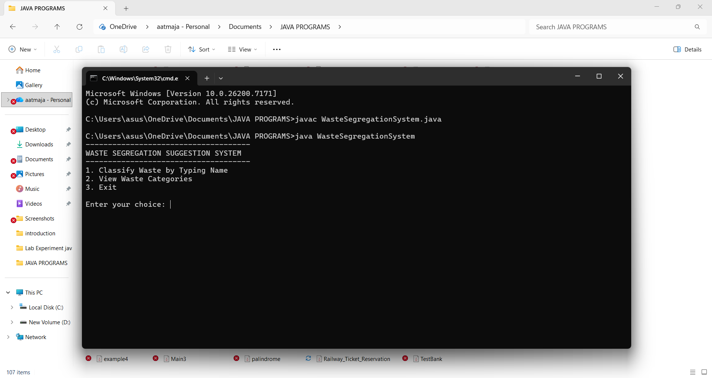
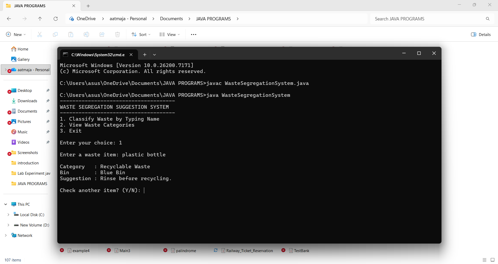

#  Smart Waste Classifier – Java Project  

A simple Java-based **Waste Segregation Suggestion System** that helps users identify the correct disposal bin based on the type of waste entered. It promotes better recycling habits and environmental awareness.

---

##  Objectives

- Identify and classify waste properly  
- Reduce land pollution and landfill waste  
- Encourage recycling and safe disposal  
- Apply Java programming concepts to solve a real-world issue  

---

##  Description

The system checks the item name provided by the user and categorizes it into:

| Waste Type | Bin Color |
|-----------|-----------|
| Wet Waste | Green Bin |
| Dry Waste | Blue Bin |
| Recyclable Waste | Blue Bin |
| Hazardous Waste | Red Bin |
| Biomedical Waste | Yellow Bin |

The user can:
- Enter waste items to classify
- View category & bin list
- Exit program anytime

---

##  Algorithm

1. Start program  
2. Show menu with 3 choices  
3. If user selects Classify:
   - Enter item name
   - Convert text to lowercase
   - Check keywords using if-else statements
   - Display correct waste category and bin
   - Ask if user wants to classify more
4. If user selects View Categories:
   - Display predefined bin rules
5. If Exit:
   - Show thank you message  
6. Stop program  

---

##  Technologies Used

- **Java**
- Concepts: `if-else`, `switch`, `loops`, `Scanner`, `String methods`

---

##  Screenshots

### Menu Page  


### Classification Output  


### Waste Categories  


---

##  How to Run

### Using Command Line
```bash
javac WasteSegregationSystem.java
java WasteSegregationSystem

